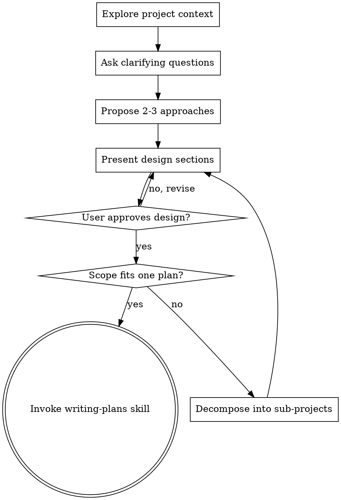

# Brainstorming Ideas Into Designs

Help turn ideas into fully formed designs and planning-ready requirements through natural collaborative dialogue.

Start by understanding the current project context, then ask questions one at a time to refine the idea. Once you understand what you're building, present the design and get user approval.

<HARD-GATE>
Do NOT invoke any implementation skill, write any code, scaffold any project, or take any implementation action until you have presented a design and the user has approved it. This applies to EVERY project regardless of perceived simplicity.
</HARD-GATE>

## Anti-Pattern: "This Is Too Simple To Need A Design"

Every project goes through this process. A todo list, a single-function utility, a config change - all of them. "Simple" projects are where unexamined assumptions cause the most wasted work. The design can be short, but you MUST present it and get approval.

## Checklist

You MUST create a task for each of these items and complete them in order:

1. **Explore project context** - check files, docs, recent commits
2. **Ask clarifying questions** - one at a time, understand purpose/constraints/success criteria
3. **Propose 2-3 approaches** - with trade-offs and your recommendation
4. **Present design** - in sections scaled to their complexity, get user approval after each section
5. **Validate scope for one plan** - split large work into smaller sub-projects before implementation
6. **Transition to implementation** - invoke writing-plans to create one merged `plan` artifact

## Process Flow

**The terminal state is invoking writing-plans.** Do NOT invoke frontend-design, mcp-builder, or any other implementation skill. The ONLY skill you invoke after brainstorming is writing-plans.

## The Process

**Understanding the idea:**

- Check out the current project state first (files, docs, recent commits)
- Before asking detailed questions, assess scope: if the request describes multiple independent subsystems, flag this immediately
- If the project is too large for a single plan, help the user decompose into sub-projects: what are the independent pieces, how do they relate, what order should they be built?
- Each sub-project gets its own plan -> implementation cycle
- For appropriately-scoped projects, ask questions one at a time to refine the idea
- Prefer multiple choice questions when possible, but open-ended is fine too
- Only one question per message - if a topic needs more exploration, break it into multiple questions
- Focus on understanding: purpose, constraints, success criteria

**Exploring approaches:**

- Propose 2-3 different approaches with trade-offs
- Present options conversationally with your recommendation and reasoning
- Lead with your recommended option and explain why

**Presenting the design:**

- Once you believe you understand what you're building, present the design
- Scale each section to its complexity: a few sentences if straightforward, up to 200-300 words if nuanced
- Ask after each section whether it looks right so far
- Cover: architecture, components, data flow, error handling, testing, and meaningful constraints
- Be ready to go back and clarify if something doesn't make sense

**Design for isolation and clarity:**

- Break the system into smaller units that each have one clear purpose, communicate through well-defined interfaces, and can be understood and tested independently
- For each unit, you should be able to answer: what does it do, how do you use it, and what does it depend on?
- Can someone understand what a unit does without reading its internals? Can you change the internals without breaking consumers? If not, the boundaries need work
- Smaller, well-bounded units are easier to reason about and easier to change safely

**Working in existing codebases:**

- Explore the current structure before proposing changes. Follow existing patterns
- Where existing code has problems that affect the work, include targeted improvements as part of the design
- Don't propose unrelated refactoring. Stay focused on what serves the current goal

## After the Design

- Do NOT write a separate spec artifact in the live workflow
- Invoke writing-plans to create a single written `plan` that merges the approved requirements, architecture, constraints, and implementation shape
- The written `plan` should preserve the design decisions validated during brainstorming rather than re-inventing them
- If the user explicitly wants to stop after design approval and defer the written plan, stop there and wait

## Implementation

- Invoke the writing-plans skill to create the merged `plan`
- Do NOT invoke any other skill. writing-plans is the next step

## Key Principles

- **One question at a time** - Don't overwhelm with multiple questions
- **Multiple choice preferred** - Easier to answer than open-ended when possible
- **YAGNI ruthlessly** - Remove unnecessary features from all designs
- **Explore alternatives** - Always propose 2-3 approaches before settling
- **Incremental validation** - Present design, get approval before moving on
- **Be flexible** - Go back and clarify when something doesn't make sense
