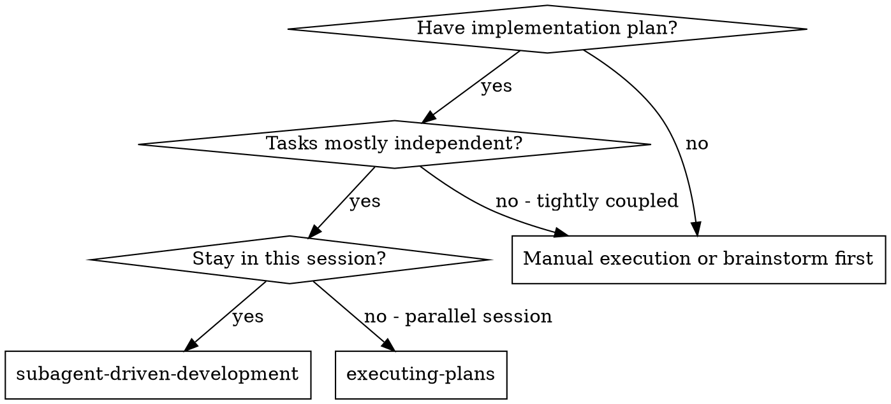
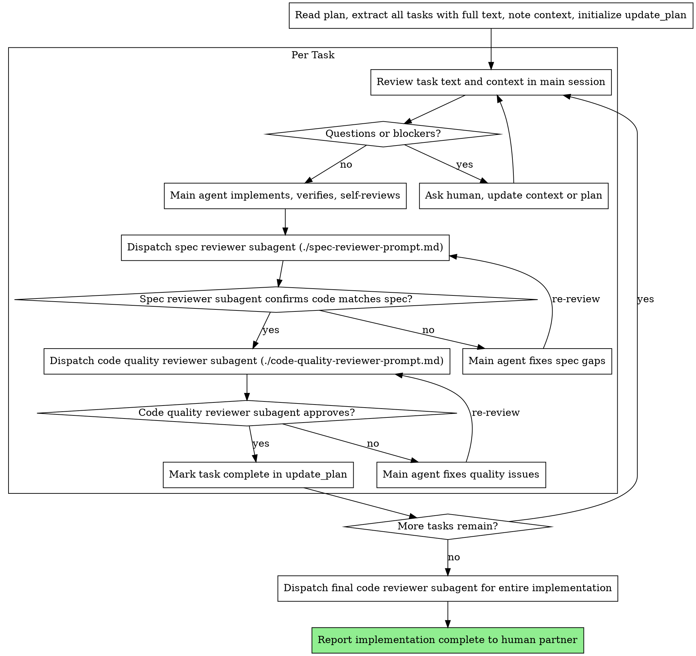

# Subagent-Driven Development

Execute the plan in the main session, with fresh reviewer subagents after each task: spec compliance review first, then code quality review.

**Why subagents:** Use reviewer subagents with isolated context to audit each task without inheriting the main session's assumptions. You construct exactly what they need, they read the actual code, and they pressure-test the work from the outside.

**Core principle:** Main agent implements + fresh reviewer subagent per review stage = high quality, fast iteration

Testing strategy comes from the plan: use strict TDD for tasks with a clear failing-test seam, and use lighter verification for docs, mechanical edits, or structural work that is not meaningfully test-first.

This is a first-class execution path. Use it when the user chooses subagent-driven execution, or when they have already shown a strong preference for it. Keep using it unless the user explicitly asks to switch to `superpowers:executing-plans`.

## When to Use



**vs. Executing Plans (parallel session):**
- Same session (no context switch)
- Main agent keeps full implementation context
- Fresh reviewer subagents per task (no review-context pollution)
- Two-stage review after each task: spec compliance first, then code quality
- Faster iteration (no human-in-loop between tasks)

## The Process



## Model Requirement

When dispatching any subagent for this workflow in Codex, explicitly set the model name to `gpt-5.4` (latest GPT model) and set `reasoning_effort` explicitly.

This applies to:
- spec reviewer subagents
- code quality reviewer subagents
- the final code reviewer subagent

Use `reasoning_effort: "high"` by default for per-task reviewer subagents, and raise it to `reasoning_effort: "xhigh"` for unusually subtle, risky, or whole-implementation reviews.

Do not leave model or reasoning selection implicit. In this workflow, do not use `medium` or lower — the pure-exploration exception does not apply because these subagents are evaluating deliverables, not just exploring.

Use the literal model string `gpt-5.4` in each `spawn_agent(...)` call so the workflow is consistent and reproducible.

## Codex Progress Visibility

Codex reviewer subagents cannot stream partial progress back to the parent while they are still running. The parent only receives the normal subagent response after that subagent stops.

Work around this with shared progress files:
- Before dispatch, create one unique progress file path per subagent.
- Pass that path in the subagent prompt.
- Tell the subagent to append short checkpoints when it starts, finishes a major milestone, gets blocked, or is about to hand back control.
- Inspect that file from the main session while the subagent keeps running.
- Treat the file as advisory status. The subagent's final response is still the authoritative result.

Never have multiple subagents write to the same progress file.

## Main-Agent Implementation Rules

For each task, the main agent should:
- Re-read the extracted task text and scene-setting context before coding
- Ask the human for clarification before coding if requirements, assumptions, or dependencies are unclear
- Implement exactly what the task specifies
- Write or update the verification the task calls for; use TDD only when the task provides a real failing-test seam
- Run the relevant verification before dispatching reviewers
- Work carefully in large or tangled files and note concerns instead of quietly broadening scope

If blocked:
1. If context is missing, ask the human and pause the task
2. If the task is too large, break it into smaller pieces or revisit the plan
3. If the plan is wrong, escalate to the human instead of guessing
4. Do not offload routine implementation to another subagent just to escape the context

## Self-Review Before Reviewers

Before dispatching either reviewer, inspect the work with fresh eyes.

**Completeness:**
- Did I implement every requirement in the task?
- Did I miss any edge cases or acceptance criteria?

**Quality:**
- Are names accurate and clear?
- Is the code maintainable and aligned with existing patterns?
- Did this task bloat a file or blur responsibilities?

**Discipline:**
- Did I avoid overbuilding?
- Did I stay inside the task's scope?

**Testing:**
- Did I use the testing strategy the plan called for?
- If TDD was required, did I actually do red-green-refactor?
- If TDD did not fit, did I choose sensible verification and record the outcome?

## Prompt Templates

- `./spec-reviewer-prompt.md` - Dispatch spec compliance reviewer subagent
- `./code-quality-reviewer-prompt.md` - Dispatch code quality reviewer subagent

## Example Workflow

```
You: I'm using Subagent-Driven Development to execute this plan.

[Read plan file once: docs/superpowers/plans/feature-plan.md]
[Extract all 5 tasks with full text and context]
[Initialize `update_plan` with all tasks]

Task 1: Hook installation script

[Get Task 1 text and context (already extracted)]
[Ask human: should the hook be installed at user or system level?]
You: "User level (~/.config/superpowers/hooks/)"
[Implement task in main session]
[Run tests, 5/5 passing]
[Self-review: notice --force flag is missing, add it before review]

[Dispatch spec compliance reviewer]
[Create progress file: .codex/progress/task-1-spec-review.md]
[Inspect progress file while reviewer runs]
Spec reviewer: ✅ Spec compliant - all requirements met, nothing extra

[Prepare task diff range, dispatch code quality reviewer]
[Create progress file: .codex/progress/task-1-code-review.md]
[Inspect progress file while reviewer runs]
Code reviewer: Strengths: Good test coverage, clean. Issues: None. Approved.

[Mark Task 1 complete in `update_plan`]

Task 2: Recovery modes

[Get Task 2 text and context (already extracted)]
[Implement task in main session]
[Run tests, 8/8 passing]
[Self-review says all good]

[Dispatch spec compliance reviewer]
Spec reviewer: ❌ Issues:
  - Missing: Progress reporting (spec says "report every 100 items")
  - Extra: Added --json flag (not requested)

[Fix issues in main session]
[Remove --json flag, add progress reporting]

[Spec reviewer reviews again]
Spec reviewer: ✅ Spec compliant now

[Dispatch code quality reviewer]
Code reviewer: Strengths: Solid. Issues (Important): Magic number (100)

[Fix issues in main session]
[Extract PROGRESS_INTERVAL constant]

[Code reviewer reviews again]
Code reviewer: ✅ Approved

[Mark Task 2 complete in `update_plan`]

...

[After all tasks]
[Dispatch final code-reviewer]
Final reviewer: All requirements met

[Report implementation complete, summarize verification, leave branch/worktree state unchanged]
```

## Advantages

**vs. Manual execution:**
- Main agent keeps full task and codebase context while implementing
- Reviewer subagents provide skeptical, isolated checks
- Review order is explicit and repeatable
- Self-review happens before outside review

**vs. Executing Plans:**
- Same session (no handoff)
- Progress visible by polling reviewer progress files while they run
- Review checkpoints automatic

**Efficiency gains:**
- No file reading overhead (controller provides full text)
- Main agent does not lose implementation context to a worker handoff
- Reviewer subagents get complete information upfront
- Questions surface before coding, not after review
- Long-running reviews stay visible without forcing the reviewer to stop early

**Quality gates:**
- Self-review catches issues before handoff
- Two-stage review: spec compliance, then code quality
- Review loops ensure fixes actually work
- Spec compliance prevents over/under-building
- Code quality ensures implementation is well-built

**Cost:**
- Extra reviewer subagent invocations (2 reviewers per task)
- Main agent carries the implementation workload in-session
- Review loops add iterations
- But catches issues early (cheaper than debugging later)

## Red Flags

**Never:**
- Start implementation on main/master branch without explicit user consent
- Skip reviews (spec compliance OR code quality)
- Proceed with unfixed issues
- Hand routine implementation off to an implementer subagent in this workflow
- Make reviewer subagents read the plan file when you can provide the task text directly
- Skip scene-setting context (reviewers need to understand where task fits)
- Assume `wait_agent` or the normal agent channel will show live partial progress
- Reuse one progress file across multiple subagents
- Accept "close enough" on spec compliance (spec reviewer found issues = not done)
- Skip review loops (reviewer found issues = main agent fixes = review again)
- Let self-review replace actual review (both are needed)
- **Start code quality review before spec compliance is ✅** (wrong order)
- Move to next task while either review has open issues

**If the task is unclear:**
- Ask clearly and completely before coding
- Update context or the plan as needed
- Don't rush into implementation

**If reviewer finds issues:**
- Main agent fixes them
- Reviewer reviews again
- Repeat until approved
- Don't skip the re-review

**If you hit a blocker:**
- Stop and ask for context or plan changes
- Don't dispatch an implementer subagent to "just handle it"

## Integration

**Required workflow skills:**
- **superpowers:using-git-worktrees** - REQUIRED: Set up isolated workspace before starting
- **superpowers:writing-plans** - Creates the plan this skill executes
- **superpowers:requesting-code-review** - Code review template for reviewer subagents

**During implementation:**
- **superpowers:test-driven-development** - Use when the task has a clear automated behavior seam and the plan calls for red-green-refactor

**Alternative workflow:**
- **superpowers:executing-plans** - Use for parallel session instead of same-session execution
